# Debian desktop updater evidence

Source: `674bc5ec01029b5254a937eb4972bfab10e4d038`, based on `08e2278d6`.

## Execution

Real native Tauri app in a disposable Ubuntu 26.04 VM, with X11, a graphical polkit agent, APT and dpkg. Automated UI interactions exercised actual package replacement and automatic relaunch. Screenshots below are unedited VM captures; terminal screenshots display recorded test output. The developer also tested the patched package on their main Ubuntu installation, reported success, and the installed version was confirmed as 0.1.811-beta. No screenshots or private data from that machine are included.

Published 0.1.811-beta Debian and AppImage payloads were unchanged. The test builds used a disposable signing key and local HTTPS feed because that release has no Debian updater signature or manifest target. Production keys and endpoints are unchanged by the PR. VM source overrides were limited to fixture version, key, endpoint and build settings.

## Results

| Check | Result |
| --- | --- |
| Native Rust suite | 581 passed |
| Focused Python release/updater checks | 90 passed across two runs |
| Ruff, Rust formatting, final diff checks | Passed |
| Optimized Debian and AppImage builds | Passed |
| Debian beta-to-beta update and automatic relaunch | Passed; installed executable matches the published payload |
| AppImage update and automatic relaunch | Passed; file matches published payload, no administrator prompt, Debian package unchanged |
| Manual versus in-app install | All nine compared groups identical; all 1,575 installed package versions matched |
| Data preservation | Saved conversation, message, setting and cache/data sentinels survived |
| Desktop integration | One visible Debian launcher; hidden protocol handler retained; installer temporary directories cleaned |
| Authentication | Actual system prompt, incorrect password, cancellation and absent-agent paths exercised |
| Package failures | Modified signature, package-manager lock and missing dependency rejected; backend recovered |
| Package validation | Wrong name, architecture, advertised version, older/equal version, empty/oversized input and invalid arguments rejected |
| Interrupted install | Unpacked package state rejected with a repair instruction |
| Version handling | Beta-to-stable promotion passed; stable-to-beta rollback rejected |
| Concurrent install | Both earlier downgrade reproductions fail safely after the APT version-guard fix |

The manual route used `sudo apt install ./published.deb` followed by app launch. Its measured baseline matched the in-app route. Comparison covered package identity/status, all package file hashes/ownership/modes, dpkg verification, the full package inventory, manual-package marks, saved data, sentinels, launchers and installer cleanup. It does not claim identical logs, cache timestamps or process IDs. The VM automation account used passwordless sudo for the manual route; the in-app route used real graphical authentication.

The final test reduction retained the consequential regressions. The input-limit helper was inlined without changing production behavior, followed by the final native suite, independent review and a new optimized build used for the successful main-machine test. Added tests comprise 119 of 473 added lines (25.2%), including inline Rust tests and fixtures.

## Commands and scope

- `cargo test --locked` with `CARGO_BUILD_JOBS=2 CARGO_PROFILE_DEV_DEBUG=0`: 581 passed.
- `pytest -q tests/security/test_release_desktop_integrity.py tests/security/test_release_desktop_signing_simulation.py tests/security/test_release_desktop_appimage.py tests/security/test_desktop_updater_pointer.py`: 65 passed, 26 skipped.
- `pytest -q tests/security/test_release_desktop_permissions.py tests/security/test_release_desktop_signing.py tests/security/test_desktop_release_resolver.py`: 25 passed.
- `ruff check tests/security/test_release_desktop_integrity.py`, `rustfmt --check --edition 2021 src/debian_update.rs`, `git diff --check`: passed.

The 26 skipped checks execute Windows signing steps and require PowerShell. Native Windows/macOS behavior, other distribution versions and graphical software-center installation were not executed. GPU training was outside this updater task. Build and suite logs are included; fixture home paths in text records are replaced with placeholders.

## Screenshots

### In-app update offer

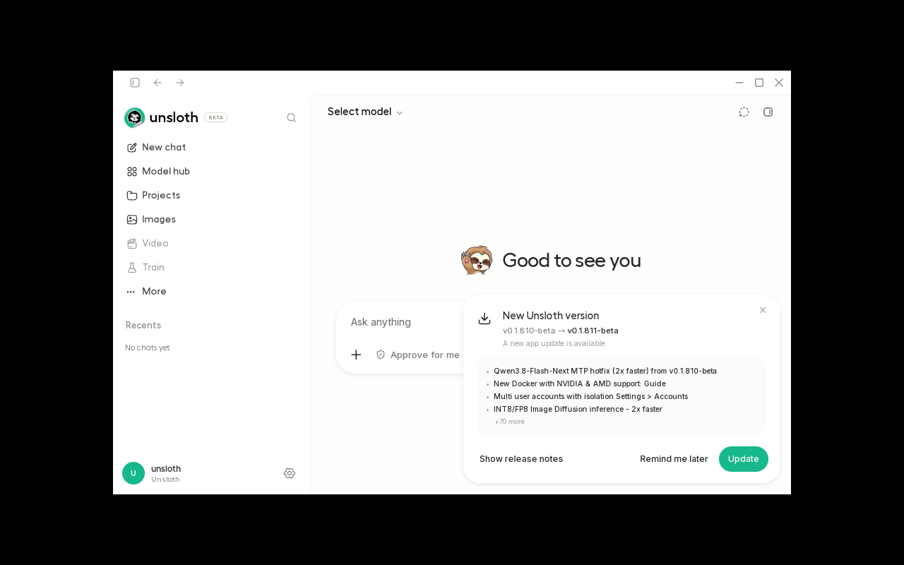

### System administrator authentication

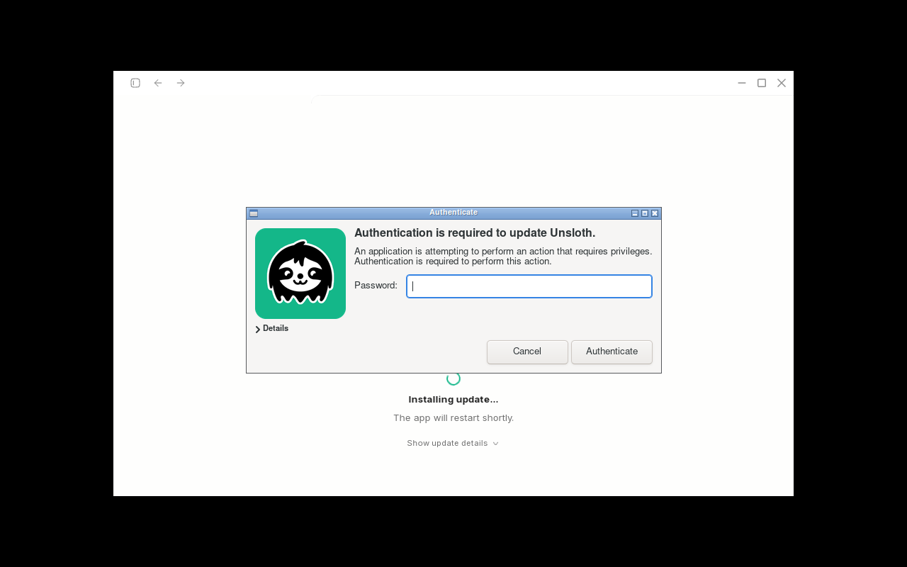

### Modified package rejected and backend recovered

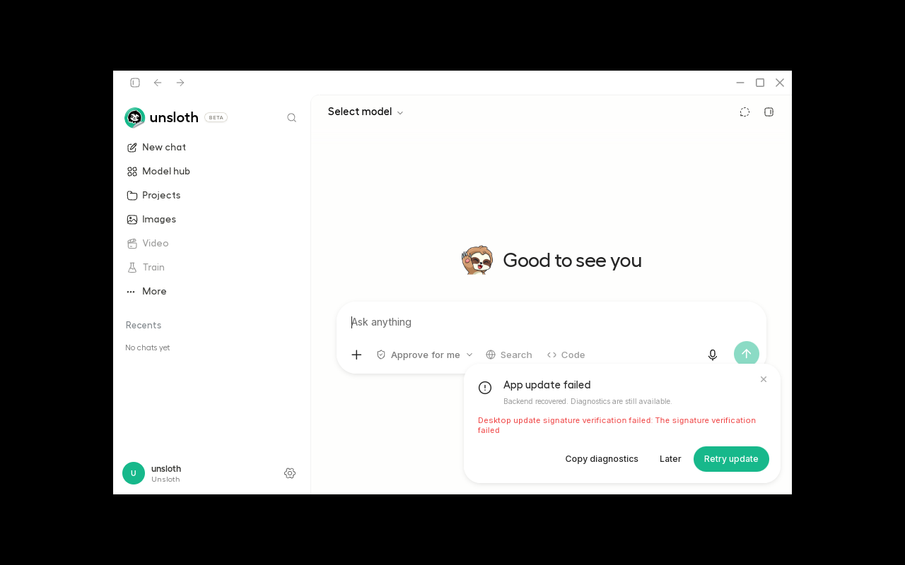

### Authentication cancelled and backend recovered

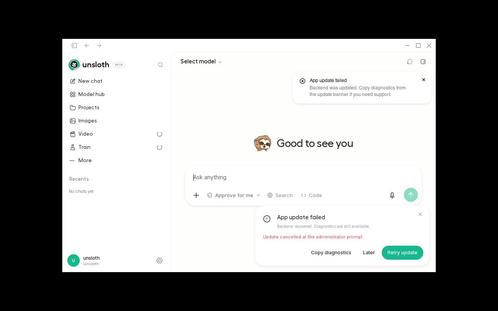

### Package-manager lock failure and recovery

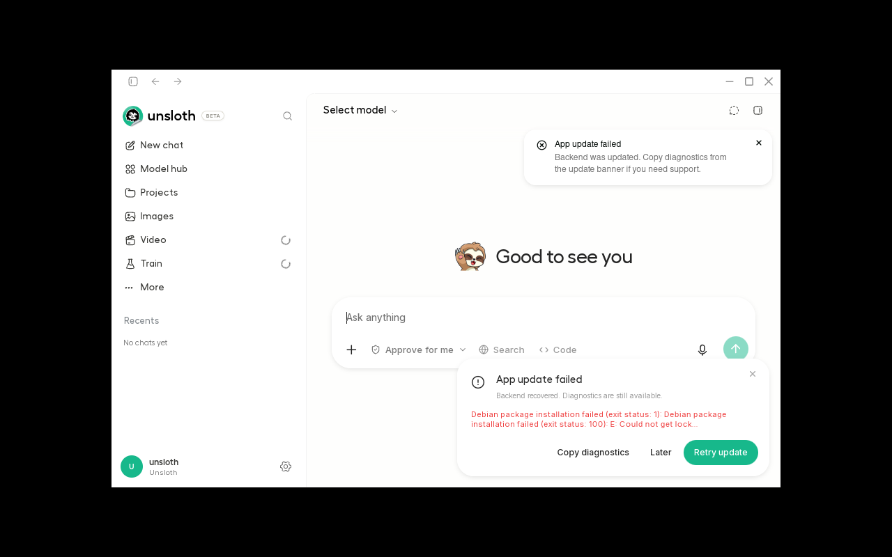

### Dependency failure and recovery

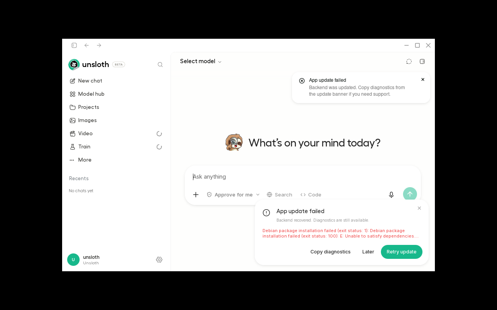

### Debian upgrade automatically relaunched

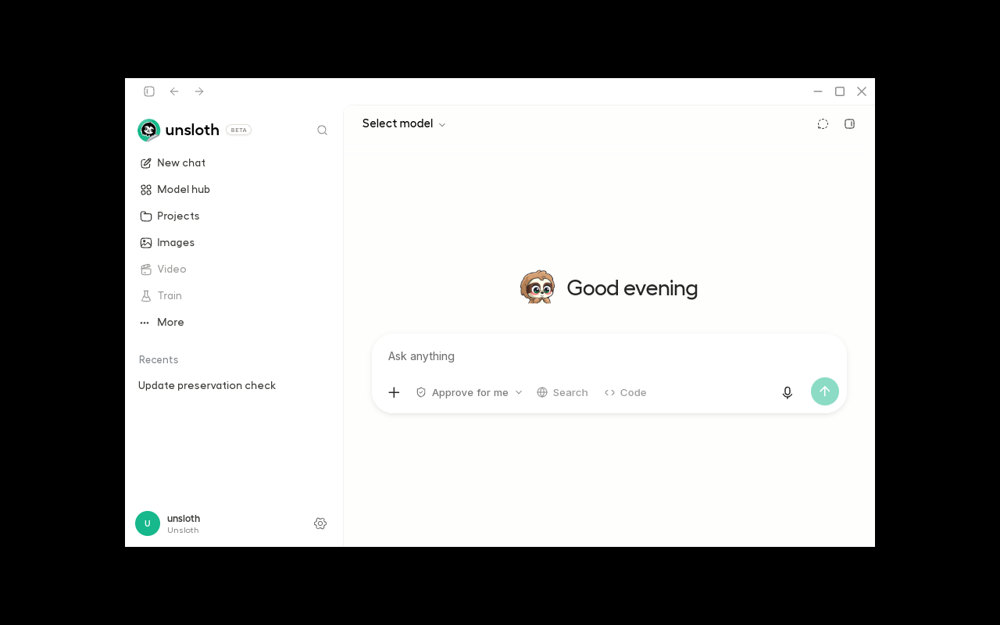

### Updated Debian version in settings

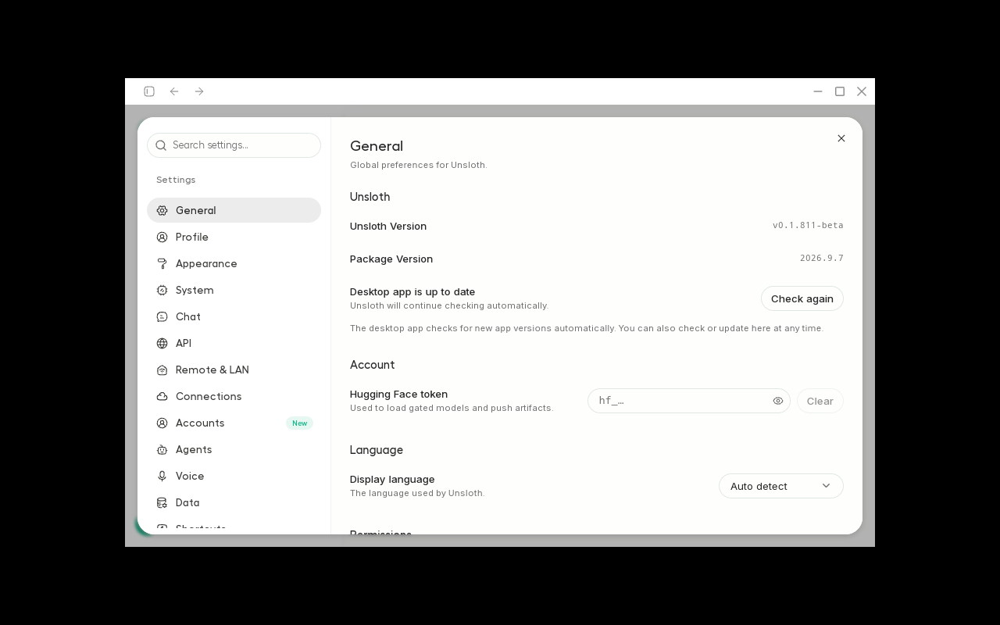

### Beta-to-stable promotion relaunched

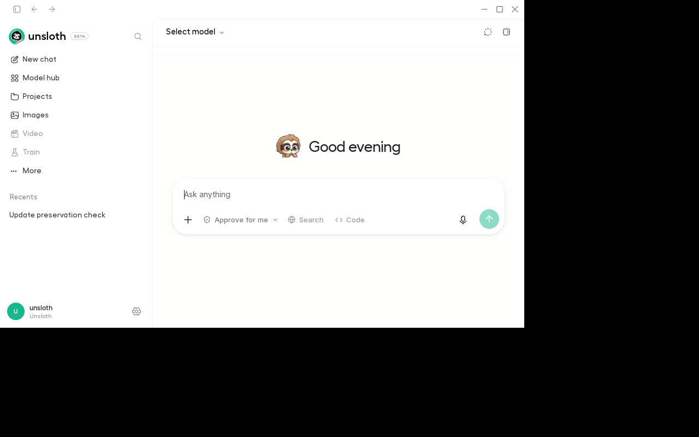

### Saved message after AppImage update

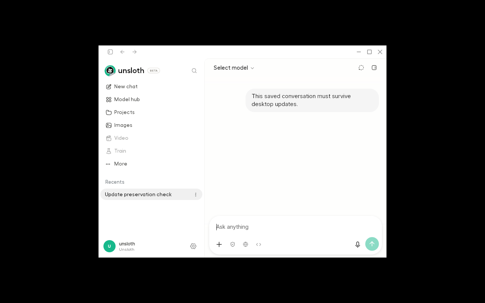

### Published AppImage version after automatic relaunch

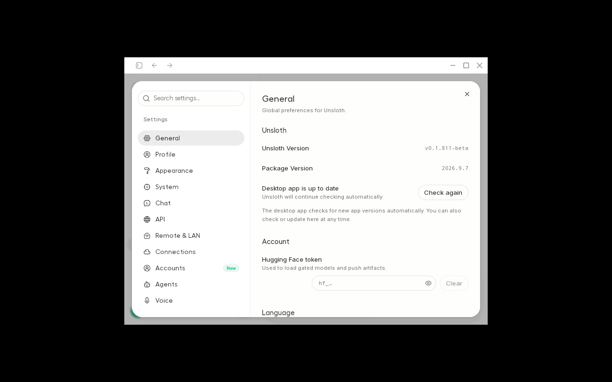

### Recorded concurrent-installation checks

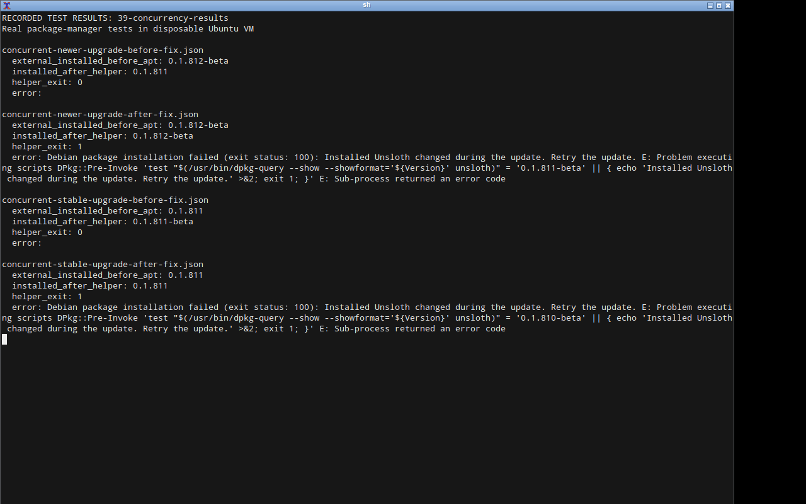

### Recorded manual versus in-app comparison

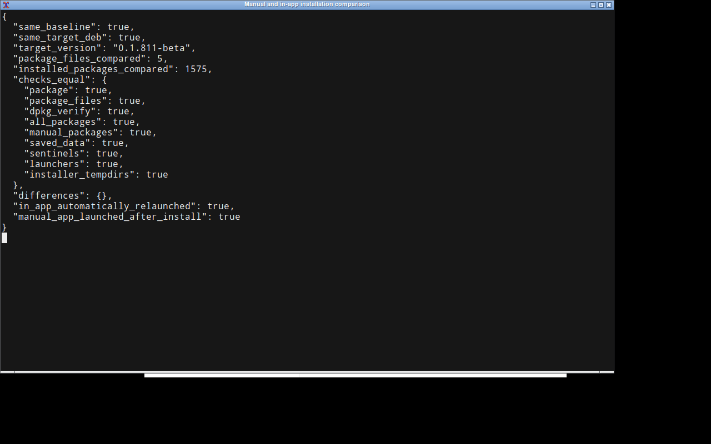

## Recorded outputs

- [appimage-build.log](results/appimage-build.log)
- [appimage-real-upgrade.json](results/appimage-real-upgrade.json)
- [beta-to-stable.json](results/beta-to-stable.json)
- [cancelled-authentication.json](results/cancelled-authentication.json)
- [concurrent-newer-upgrade-after-fix.json](results/concurrent-newer-upgrade-after-fix.json)
- [concurrent-newer-upgrade-before-fix.json](results/concurrent-newer-upgrade-before-fix.json)
- [concurrent-stable-upgrade-after-fix.json](results/concurrent-stable-upgrade-after-fix.json)
- [concurrent-stable-upgrade-before-fix.json](results/concurrent-stable-upgrade-before-fix.json)
- [final-optimized-build.log](results/final-optimized-build.log)
- [in-app-after-launch.json](results/in-app-after-launch.json)
- [in-app-baseline.json](results/in-app-baseline.json)
- [interrupted-package-state.json](results/interrupted-package-state.json)
- [manual-after-launch.json](results/manual-after-launch.json)
- [manual-baseline.json](results/manual-baseline.json)
- [manual-versus-in-app.json](results/manual-versus-in-app.json)
- [missing-authentication-agent.json](results/missing-authentication-agent.json)
- [native-tests-pr-final.log](results/native-tests-pr-final.log)
- [package-manager-lock.json](results/package-manager-lock.json)
- [preservation-and-single-launcher.json](results/preservation-and-single-launcher.json)
- [published-package-integrity.json](results/published-package-integrity.json)
- [published-package-upgrade.json](results/published-package-upgrade.json)
- [python-release-checks-pr-final.log](results/python-release-checks-pr-final.log)
- [python-tests-pr-final.log](results/python-tests-pr-final.log)
- [root-boundary-tamper.json](results/root-boundary-tamper.json)
- [root-empty-input.json](results/root-empty-input.json)
- [root-equal-version.json](results/root-equal-version.json)
- [root-extra-argument.json](results/root-extra-argument.json)
- [root-older-version.json](results/root-older-version.json)
- [root-oversized-input.json](results/root-oversized-input.json)
- [root-too-long-version.json](results/root-too-long-version.json)
- [root-version-mismatch.json](results/root-version-mismatch.json)
- [root-wrong-architecture.json](results/root-wrong-architecture.json)
- [root-wrong-name.json](results/root-wrong-name.json)
- [scoped-authentication-cancelled.json](results/scoped-authentication-cancelled.json)
- [stable-to-beta-rejected.json](results/stable-to-beta-rejected.json)
- [tampered-cache-ui.json](results/tampered-cache-ui.json)
- [unavailable-dependency.json](results/unavailable-dependency.json)
